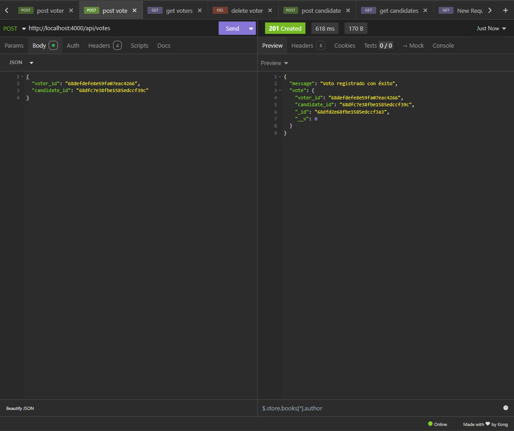

#  Sistema de Votaciones API

API REST para gestionar un sistema de votaciones con **Node.js**, **Express**, **MongoDB (Atlas)** y **JWT**.  
Permite registrar usuarios, votantes, candidatos y registrar votos de manera segura con autenticación.

---

##  Tecnologías
- Node.js + Express
- MongoDB con Mongoose
- JWT (Json Web Token) para autenticación
- bcryptjs para encriptar contraseñas

---

##  Requisitos
- Node.js (v22 sobre esta versión se desarrolló la aplicación)
- Una cuenta en [MongoDB Atlas](https://www.mongodb.com/cloud/atlas) o MongoDB local
- Git
  
---

##  Observaciones
- el proyecto cuenta con las validaciones requeridas
- Se hace un correcto manejo de errores
- Se usa una buena estructura arquitectónica para el código
- para el logeo se usa un único perfil administrador el cual tokeniza y puede acceder a todos los endpoint, de lo contrario será negado

##  Instalación y ejecución en local

1. **Clonar el repositorio**
   ```bash
   [git clone https://github.com/Kevin-1515/sistema-de-votaciones.git]
   cd sistema-votaciones

2. **Instalar dependencias**
   ```bash
   npm install
   
3. **Cconfigurar variables de entorno  (crear el archivo .env en la raíz del proyecto)**
   ```env
   MONGO_URI="debe ponerse la uri de una bd creada por el ejecutor"
   PORT=4000

4. **Iniciar el servidor**
   ```bash
   npm run dev

   // el server queda corriebndo bajo el puerto 4000   http://localhost:4000/

   

2. **Instalar dependencias**
   ```bash
   npm install

---

## Es necesario usar un cliente rest para hacer uso de los endpoints como postman o insomnia

### endpoints principales 
   ```bash


   //logeo
   http://localhost:4000/auth/register

   {
  "email": "kevin@admin.com",
  "password": "123456"
   }

   http://localhost:4000/auth/login

   {
  "email": "kevin@admin.com",
  "password": "123456"
   }

   // Métodos post votos votantes y candidatos

   http://localhost:4000/api/voters

   {
  "name": "daniela ruiz",
  "email": "daniela@inntech.com"
   }

   http://localhost:4000/api/candidates

   {
  "name": "Eduardo sandoval",
  "party": "Partido rojo"
   }

   http://localhost:4000/api/votes

   {
  "voter_id": "68dfc5d08fbe1585edccf396",
  "candidate_id": "68dfc8428fbe1585edccf39e"
   }

   //rutas Métodos get principales
   
   http://localhost:4000/api/voters

   http://localhost:4000/api/candidates

   http://localhost:4000/api/votes/stats/all




